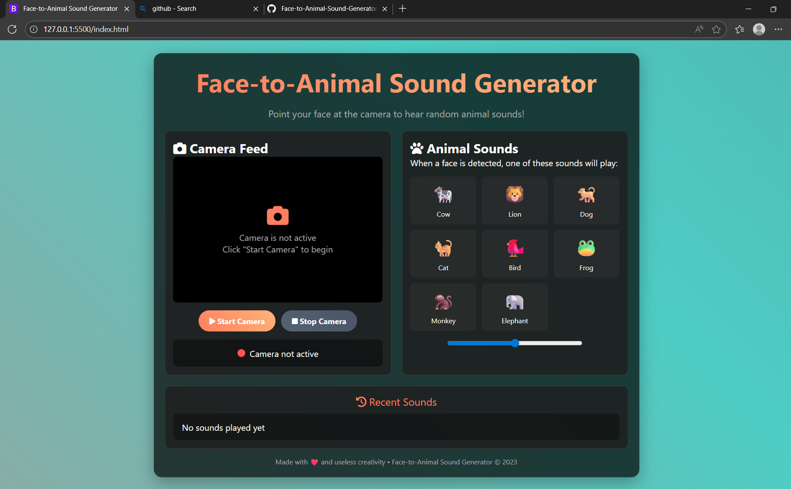
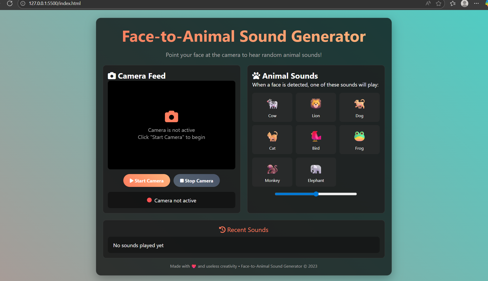
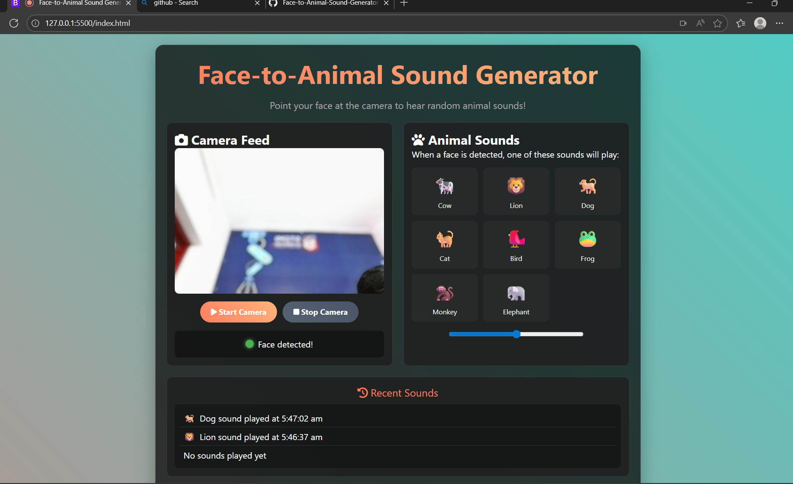

# Face to animal sound generator 🎯

## Basic Details
### Team Name: [Bit_by_bit]

### Team Members
- member1:[Pavithra A] - [MBCCET Kuttikanom]
- Member 2: [Harinandana S] -[MBCCET Kuttikanom]
  

### Project Description
[Face to animal sound generator is fun website,is a fun,  that takes a photo of your face and transforms it into an animal sound effect that best matches your vibe. Upload a selfie or use your webcam, and in seconds, the system analyzes your facial expressions and personality traits, then plays an animal sound that represents you!]

### The Problem (that doesn't exist)
[What ridiculous problem are you solving?]

### The Solution (that nobody asked for)
[How are you solving it? Keep it fun!]

## Technical Details
### Technologies/Components Used
For Software:
- [HTML]

### Project Demo

https://github.com/Harinandana0671/face--to---animal-sound-generator/blob/main/WhatsApp%20Video%202025-08-02%20at%2007.04.12_71485548.mp4
---
Made with ❤️ at TinkerHub Useless Projects 

